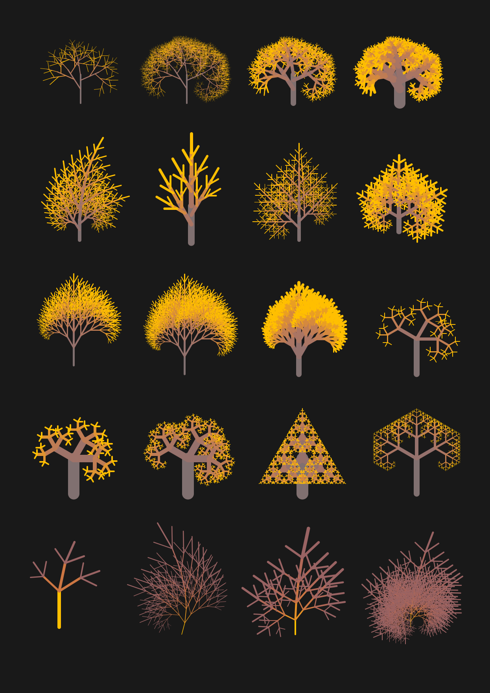
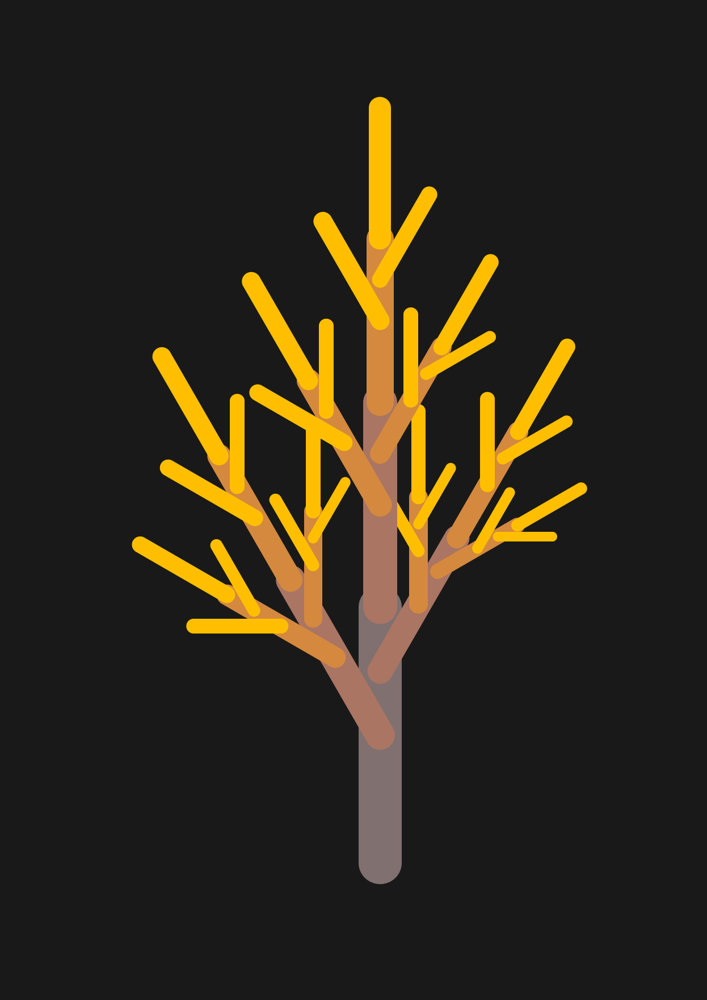
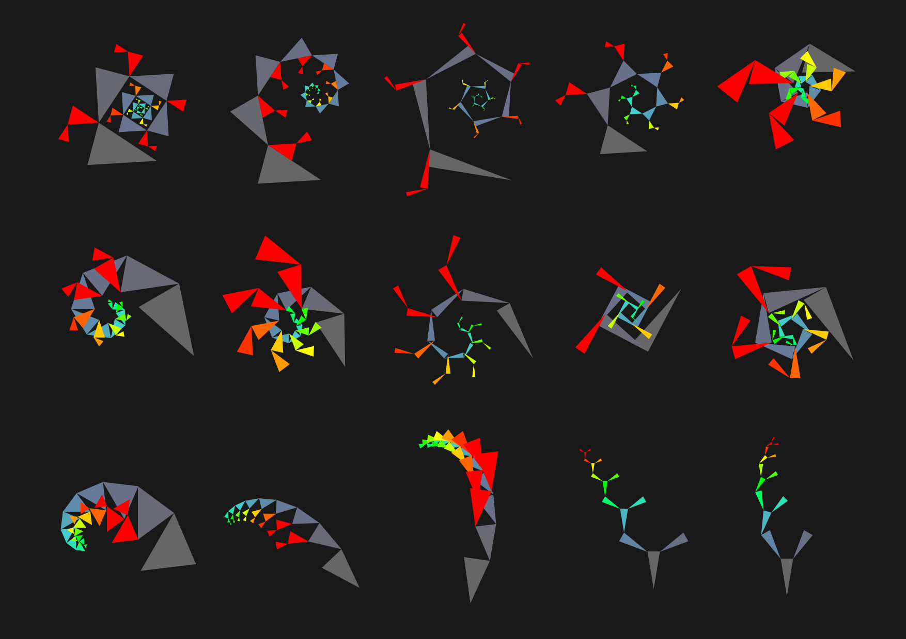
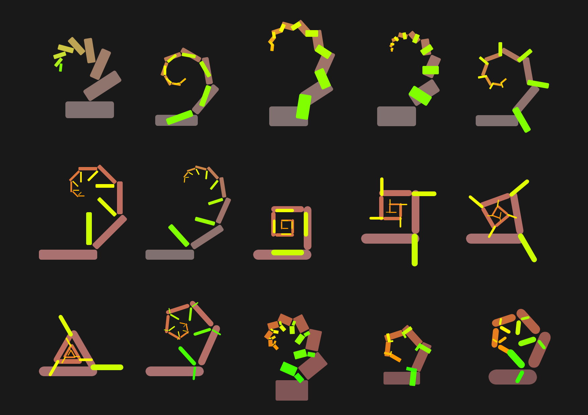
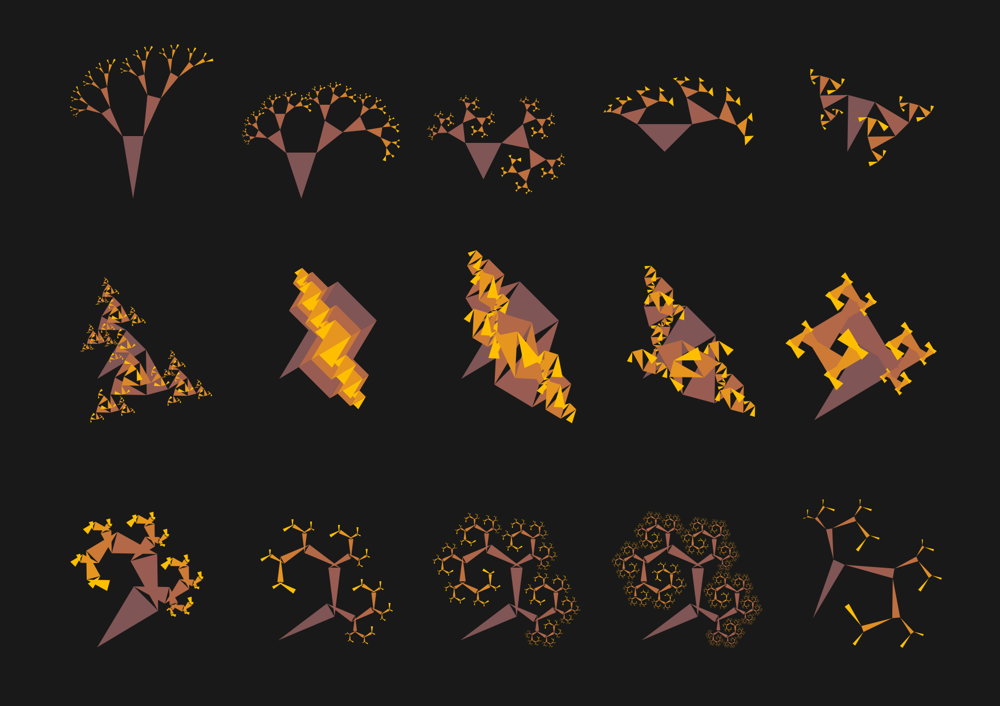
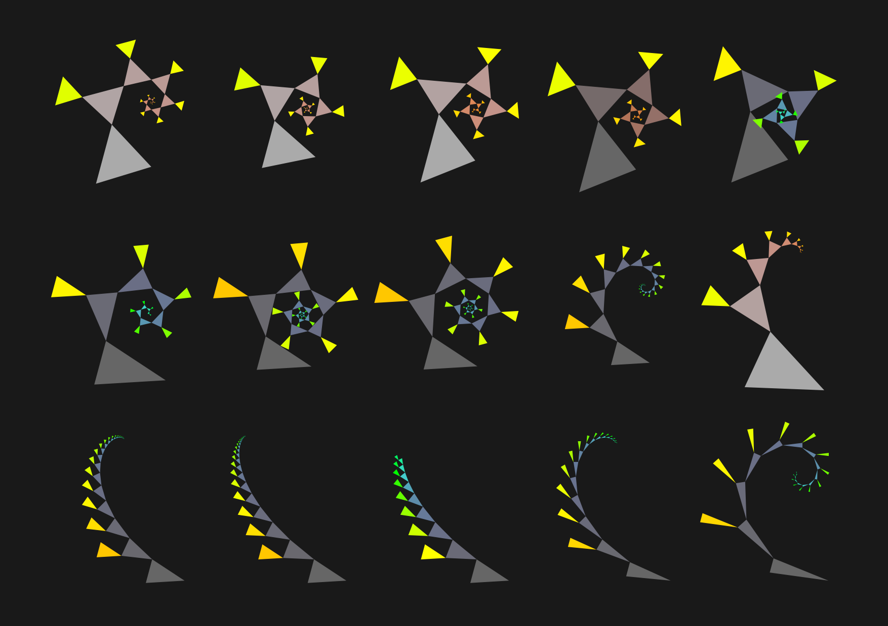

# 'Biodiversity' (A PostScript Pattern Generator)

This script is a single plain .ps (PostScript) file.

To preview the results of the script, open or import it directly to a vector editing application, such as the free Inkscape or commercial Adobe Illustrator. You can also use the free PostScript language interpreter called Ghostscript.

To edit the script and get some interesting results, open it with the code or plain text editor (e.g. Notepad++, which recognizes and marks-up the PostScript syntax), and then play with the script's 'public' parameters. For example, try setting the following values to get the image below:

  BACKGROUND:\
    background gray = 0.333\
    background outline toggle = 0\
    background outline gray = 0.25\
    background outline line width = 3
  
  FRACTAL:\
    fractal depth = 4\
    initial translation = [ 300,  50 ]\
    initial rotation = 0\
    initial scale = [ 1,  1 ]\
    initial shape size = 200\
    initial shape width & height factors = [ 1.0,  1.0 ]\
    initial shape line width = 33\
    initial shape line cap style  = 1
  
  BRANCHING:\
    branch translation factors = [ 0.5,  0.25,  0.0 ]\
    branch rotation = [ 30,  -30,  0 ]\
    branch scale factors= [ 0.7,  0.6,  0.8 ]
  
  HSB COLOR GRADIENT:\
    HSB begin = [ 0.0,  0.125,  0.5 ]\
    HSB end = [ 0.125,  1.0,  1.0 ]\
    HSB increment = [ 0.0416667,  0.291667,  0.166667 ]

The artwork presented below was originally created for the Croatian ‘Year of Biodiversity’ graphic design contest back in 2010, but it was not completed nor published at that time.

The theme of the contest suggested to me some possible use of a systematic formal variation to create diverse instances of a basic visual structure. For simplicity, the chosen field of diversity was that of abstract 'phytomorphology' - i.e. geometrically and coloristicaly stylized plant forms.

The basic idea was to use a simple generative approach: the graphics were conceived to be just some basic vector drawing elements, combined recursively into more complex, more significant constructions, forming eventually the families of similar 'Gestalts', related by the similarities in their parameters - the predictable and unpredictable consequences of a single simple underlying program.

The generated outputs were collected into classes and presented without much further graphical intervention.

Some examples, generated by this script: https://www.behance.net/gallery/10798261/A-Simple-Parametric-PostScript-Tree-Generator

Although never completed, this old work was published in 2017 in the book "Bézier Vol.1: The Best Vector Artists Worldwide" by Crooks Press (now Capsules Books), Melbourne:

https://capsulesbook.com/bezier-volume1-1/bzier-volume1

